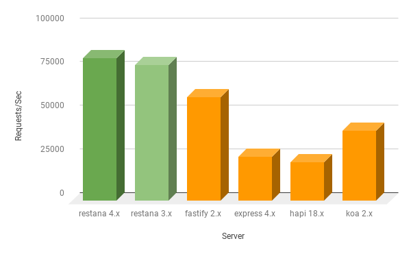

# restana
[](https://travis-ci.org/jkyberneees/ana)
[](https://www.npmjs.com/package/restana)  
Blazing fast, tiny and minimalist *connect-like* web framework for building REST micro-services.  


> MacBook Pro 2019, 2,4 GHz Intel Core i9, 32 GB 2400 MHz DDR4  
> - wrk -t8 -c40 -d5s http://127.0.0.1:3000/hi

Read more:  *[Building ultra-fast REST APIs with Node.js (restana vs express vs fastify)](https://medium.com/@kyberneees/building-ultra-fast-rest-apis-with-node-js-and-restana-1d65b0d524b7)*

## Usage
```bash
npm i restana --save
```
### Creating the service instance
Create unsecure HTTP server:
```js
const service = require('restana')()
```
Passing HTTP server instance:
```js
const https = require('https')
const service = require('restana')({
  server: https.createServer({
    key: keys.serviceKey,
    cert: keys.certificate
  })
})
```

> See examples:
> * [HTTPS service demo](demos/https-service.js)
> * [HTTP2 service demo](demos/http2-service.js)

### Configuration options
- `server`: Allows to optionally override the HTTP server instance to be used.
- `prioRequestsProcessing`: If `TRUE`, HTTP requests processing/handling is prioritized using `setImmediate`. Default value: `TRUE`
- `defaultRoute`: Optional route handler when no route match occurs. Default value: `((req, res) => res.send(404))`
- `errorHandler`: Optional global error handler function. Default value: `(err, req, res) => res.send(err)`
- `routerCacheSize`: The router matching cache size, indicates how many request matches will be kept in memory. Default value: `2000`


### Full service example
```js
const bodyParser = require('body-parser')

const service = require('restana')()
service.use(bodyParser.json())

const PetsModel = {
  // ... 
}

// registering service routes
service
  .get('/pets/:id', async (req, res) => {
    res.send(await PetsModel.findOne(req.params.id))
  })
  .get('/pets', async (req, res) => {
    res.send(await PetsModel.find())
  })
  .delete('/pets/:id', async (req, res) => {
    res.send(await PetsModel.destroy(req.params.id))
  })
  .post('/pets/:name/:age', async (req, res) => {
    res.send(await PetsModel.create(req.params))
  })
  .patch('/pets/:id', async (req, res) => {
    res.send(await PetsModel.update(req.params.id, req.body))
  })

service.get('/version', function (req, res) {
  // optionally you can send the response data in the body property
  res.body = { 
    version: '1.0.0'
  }
  // 200 is the default response code
  res.send() 
})
```

Supported HTTP methods:
```js
const methods = ['get', 'delete', 'put', 'patch', 'post', 'head', 'options', 'trace']
```

#### Using .all routes registration
You can also register a route handler for `all` supported HTTP methods:
```js
service.all('/allmethodsroute', (req, res) => {
  res.send(200)
})
```

#### Starting the service
```js
service.start(3000).then((server) => {})
```

#### Stopping the service
```js
service.close().then(()=> {})
```

### Async / Await support
```js
// some fake "star" handler
service.post('/star/:username', async (req, res) => {
  await starService.star(req.params.username)
  const stars = await starService.count(req.params.username)

  res.send({ stars })
})
```

### Sending custom headers:
```js
res.send('Hello World', 200, {
  'x-response-time': 100
})
```
### Acknowledge from low-level `end` operation
```js
res.send('Hello World', 200, {}, (err) => {
  if (err) {
    // upppsss
  }
})
```

### Global error handling
```js
const service = require('restana')({
  errorHandler (err, req, res) {
    console.log(`Something was wrong: ${err.message || err}`)
    res.send(err)
  }
})

service.get('/throw', (req, res) => {
  throw new Error('Upps!')
})
```

### Global middlewares
```js
const service = require('restana')()

service.use((req, res, next) => {
  // do something
  next()
});
...
```

### Prefix middlewares
```js
const service = require('restana')()

service.use('/admin', (req, res, next) => {
  // do something
  next()
});
...
```

### Route level middlewares
Connecting middlewares to specific routes is also supported:
```js
const service = require('restana')()

service.get('/admin', (req, res, next) => {
  // do something
  next()
}, (req, res) => {
  res.send('admin data')
});
...
```
#### Third party middlewares support:
> All middlewares using the `function (req, res, next)` signature format are compatible with restana.

Examples :
* **raw-body**: [https://www.npmjs.com/package/raw-body](https://www.npmjs.com/package/raw-body). See demo: [raw-body.js](demos/raw-body.js)
* **express-jwt**: [https://www.npmjs.com/package/express-jwt](https://www.npmjs.com/package/express-jwt). See demo: [express-jwt.js](demos/express-jwt.js)
* **body-parser**: [https://www.npmjs.com/package/body-parser](https://www.npmjs.com/package/body-parser). See demo: [body-parser.js](demos/body-parser.js)
* **swagger-tools**: [https://www.npmjs.com/package/swagger-tools](https://www.npmjs.com/package/swagger-tools). See demo: [swagger](demos/swagger/index.js)

#### Async middlewares support
Since version `v3.3.x`, you can also use async middlewares as described below:
```js
service.use(async (req, res, next) => {
  await next()
  console.log('All middlewares and route handler executed!')
}))
service.use(logging())
service.use(jwt())
...
```

In the same way you can also capture uncaught exceptions inside the request processing flow:
```js
service.use(async (req, res, next) => {
  try {
    await next()
  } catch (err) {
    console.log('upps, something just happened')
    res.send(err)
  }
})
service.use(logging())
service.use(jwt())
```
## AWS Serverless Integration
`restana` is compatible with the [serverless-http](https://github.com/dougmoscrop/serverless-http) library, so restana based services can also run as AWS lambdas 🚀
```js 
// required dependencies
const serverless = require('serverless-http')
const restana = require('restana')

// creating service
const service = restana()
service.get('/hello', (req, res) => {
  res.send('Hello World!')
})

// lambda integration
const handler = serverless(app);
module.exports.handler = async (event, context) => {
  return await handler(event, context)
}
``` 

## Serving static files
You can read more about serving static files with restana in this link:
https://thejs.blog/2019/07/12/restana-static-serving-the-frontend-with-node-js-beyond-nginx/

## Third party integrations
```js
// ...
const service = restana()
service.get('/hello', (req, res) => {
  res.send('Hello World!')
})

// using "the callback integrator" middleware
const server = http.createServer(service.callback())
//...
```

## Application Performance Monitoring (APM)
As a Node.js framework implementation based on the standard `http` module, `restana` benefits from out of the box instrumentation on 
existing APM agents such as:
- https://www.npmjs.com/package/newrelic
- https://www.npmjs.com/package/elastic-apm-node

### Elastic APM - Route Naming
"Routes Naming" discovery is not supported out of the box, but we have created our custom integration for Elastic APM:
```js
// getting the Elastic APM agent
const apm = require('elastic-apm-node').start({
  secretToken: process.env.APM_SECRET_TOKEN,
  serverUrl: process.env.APM_SERVER_URL
})

// getting restana instrumentator 
const elasticApm = require('restana/libs/elastic-apm')
const { patch } = elasticApm({ apm })

// creating a restana application
const service = require('restana')()

// attach route naming instrumentation before registering service routes
patch(service)

// register your routes or middlewares
service.get('/hello', (req, res) => {
  res.send('Hello World!')
})

// ...
```

## Performance comparison (framework overhead)
### Which is the fastest?
You can checkout `restana` performance index on the ***"Which is the fastest"*** project: https://github.com/the-benchmarker/web-frameworks#full-table-1

## Using this project? Let us know 🚀
https://goo.gl/forms/qlBwrf5raqfQwteH3

## Breacking changes
### 4.x:
> Restana version 4.x is much more simple to maintain, mature and faster!
#### Added
 - Node.js v10.x+ is required.
 - `0http` sequential router is now the default and only HTTP router.
 - Overall middlewares support was improved.
 - Nested routers are now supported.
 - Improved error handler through async middlewares.
 - New `getRouter` and `newRouter` methods are added for accesing default and nested routers.
#### Removed
 - The `response` event was removed.
 - `find-my-way` router is replaced by `0http` sequential router.
 - Returning result inside async handler is not allowed anymore. Use `res.send...`
### 3.x: 
#### Removed
- Support for `turbo-http` library was dropped.