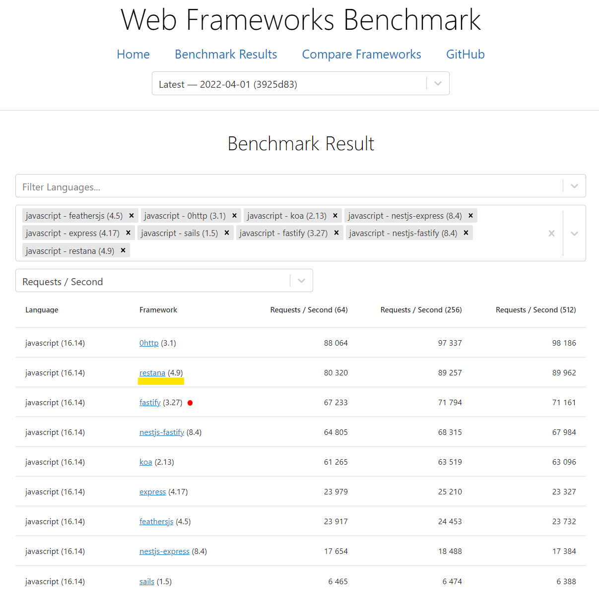

# Introduction
[](https://www.npmjs.com/package/restana)
[](https://www.npmjs.com/package/restana)
[](https://www.npmjs.com/package/restana)
[](https://www.npmjs.com/package/restana)
[](https://github.com/jkyberneees/restana)

  

Restana is a lightweight and fast Node.js framework for building RESTful APIs. Inspired by Express, it provides a simple and intuitive API for routing, handling requests and responses, and middleware management. It is designed to be easy to use and integrate with other Node.js modules, allowing developers to quickly build scalable and maintainable APIs.

Read more online:  
- restana = faster and efficient Node.js REST APIs: https://itnext.io/restana-faster-and-efficient-node-js-rest-apis-1ee5285ce66


> Check it yourself: https://web-frameworks-benchmark.netlify.app/result?f=feathersjs,0http,koa,nestjs-express,express,sails,nestjs-fastify,restana


# Usage
Install
```bash
npm i restana
```
Create unsecure API service:
```js
const restana = require('restana')

const service = restana()
service.get('/hi', (req, res) => res.send('Hello World!'))

service.start(3000);
```
Creating secure API service:
```js
const https = require('https')
const restana = require('restana')

const service = restana({
  server: https.createServer({
    key: keys.serviceKey,
    cert: keys.certificate
  })
})
service.get('/hi', (req, res) => res.send('Hello World!'))

service.start(3000);
```

Using `http.createServer()`:
```js
const http = require('http')
const restana = require('restana')

const service = restana()
service.get('/hi', (req, res) => res.send('Hello World!'))

http.createServer(service).listen(3000, '0.0.0.0')
```

# More
- Website and documentation: https://restana.21no.de
